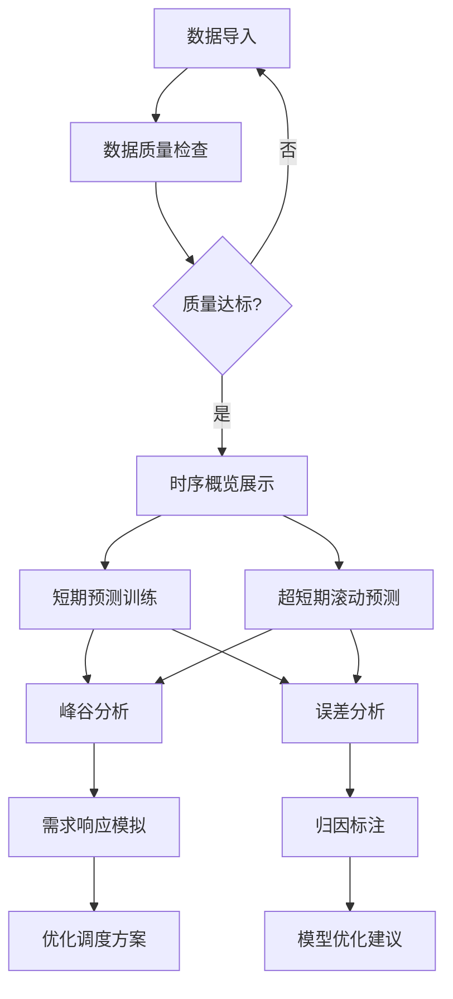

## 1. 产品概述

本系统是面向电力调度中心的区域电网负荷预测与需求响应优化分析平台，基于历史负荷和气象数据训练机器学习预测模型，并模拟削峰填谷调度策略效果，为电力调度决策提供数据支撑。

- 核心价值：提升电网负荷预测精度，优化需求响应策略，降低电网峰谷差，提高电力系统运行效率
- 目标用户：电力调度中心运行人员、负荷预测分析师、需求响应管理人员

## 2. 核心功能

### 2.1 用户角色

| 角色 | 注册方式 | 核心权限 |
|------|---------|----------|
| 调度运行人员 | 系统授权登录 | 数据导入、预测分析、策略模拟、结果查看 |
| 系统管理员 | 系统授权登录 | 全部功能权限 + 用户管理 |

### 2.2 功能模块

1. **数据导入与质量检查**：CSV文件上传、数据质量评估、时序可视化
2. **短期负荷预测(日前)**：特征工程、LightGBM/LSTM模型训练、预测结果展示
3. **超短期预测(4小时)**：滑动窗口预测、在线增量更新、预测区间展示
4. **峰谷分析**：峰谷特征提取、月度趋势分析
5. **需求响应模拟**：资源池配置、策略参数设置、线性规划优化、调度效果展示
6. **预测误差分析**：误差统计、大误差日识别、归因标注

### 2.3 页面详情

| 页面名称 | 模块名称 | 功能描述 |
|---------|----------|---------|
| 数据导入 | 文件上传 | 支持上传负荷气象数据和日历信息表CSV文件 |
| 数据导入 | 质量检查 | 缺失率统计、异常值标记、时间连续性校验 |
| 数据导入 | 时序概览 | 各字段时间序列可视化图表 |
| 短期预测 | 特征工程 | 自动生成历史负荷、滑动均值、气象、时间编码特征 |
| 短期预测 | 模型训练 | 支持LightGBM和LSTM模型切换，训练进度展示 |
| 短期预测 | 结果分析 | 预测曲线对比、MAPE/RMSE指标、特征重要性排名 |
| 超短期预测 | 滚动预测 | 基于最近2小时数据预测未来4小时16个点 |
| 超短期预测 | 在线更新 | 新数据到达后增量训练更新模型 |
| 超短期预测 | 区间预测 | 展示上下20%置信带预测区间 |
| 峰谷分析 | 特征提取 | 峰值/谷值时刻、峰谷差、日负荷率、尖峰持续时间 |
| 峰谷分析 | 趋势分析 | 按月汇总峰谷特征变化趋势图 |
| 需求响应 | 资源配置 | 空调负荷占比、工业可中断负荷、储能容量配置 |
| 需求响应 | 策略设置 | 削峰目标、响应时段、最大持续时长、舒适度约束 |
| 需求响应 | 优化求解 | 线性规划求解最优调度方案 |
| 需求响应 | 结果展示 | 调度前后曲线对比、各资源出力、成本估算 |
| 误差分析 | 误差统计 | 按日MAPE统计、误差分布直方图 |
| 误差分析 | 大误差识别 | 识别MAPE超过8%的日期 |
| 误差分析 | 归因标注 | 突发天气、节假日效应、特殊事件、数据质量问题标注 |
| 误差分析 | 相关性分析 | 误差与气温散点相关图 |

## 3. 核心流程

用户进入系统后，首先导入历史负荷和气象数据，系统自动进行数据质量检查。通过检查后，用户可选择进行短期负荷预测训练模型，或进行超短期滚动预测。基于预测结果，用户可进行峰谷特性分析，识别电网运行特征。在需求响应模块，用户配置可调资源和响应策略，系统通过线性规划求解最优调度方案，展示削峰填谷效果。最后通过误差分析模块评估预测精度，识别大误差日并进行归因标注，持续优化模型性能。

## 4. 用户界面设计

### 4.1 设计风格

- 主色调：深蓝色(#1E3A5F)代表电力行业专业性，搭配青绿色(#38B2AC)作为强调色
- 辅助色：橙色(#ED8936)用于预警提示，绿色(#38A169)表示正常状态
- 按钮风格：圆角矩形，悬停有过渡动画，主按钮深蓝色渐变
- 字体：标题使用"思源黑体"加粗，正文使用"微软雅黑"，数字使用等宽字体
- 布局风格：侧边栏导航 + 主内容区卡片式布局，图表与数据指标分区展示
- 图标风格：使用简洁线性图标，配合同色系填充

### 4.2 页面设计概述

| 页面名称 | 模块名称 | UI元素 |
|---------|----------|--------|
| 数据导入 | 文件上传 | 拖拽上传区域、文件列表、上传进度条 |
| 数据导入 | 质量检查 | 数据质量评分仪表盘、缺失率热力图、异常值标记表格 |
| 数据导入 | 时序概览 | 多标签页时间序列折线图、字段选择器、时间范围选择器 |
| 短期预测 | 特征工程 | 特征相关性热力图、特征列表复选框、特征统计摘要 |
| 短期预测 | 模型训练 | 模型选择切换卡、训练进度条、训练日志滚动区 |
| 短期预测 | 结果分析 | 预测对比双折线图、指标卡片组、特征重要性横向柱状图 |
| 超短期预测 | 滚动预测 | 实时数据流展示、预测区间填充图、更新状态指示器 |
| 峰谷分析 | 特征提取 | 日负荷曲线图带峰谷标记、特征指标卡片组 |
| 峰谷分析 | 趋势分析 | 多系列折线图展示月度峰谷变化趋势 |
| 需求响应 | 资源配置 | 滑块配置组件、资源参数输入表单 |
| 需求响应 | 策略设置 | 时段选择器、参数滑块、约束条件复选框 |
| 需求响应 | 结果展示 | 调度前后对比堆叠面积图、资源出力堆叠图、成本节省数字动画 |
| 误差分析 | 误差统计 | MAPE时间序列图、误差分布直方图 |
| 误差分析 | 归因标注 | 大误差日表格、归因标签选择器、误差-气温散点图 |

### 4.3 响应性

- 桌面端优先设计，主内容区最小宽度1200px
- 侧边栏可折叠，适应不同屏幕尺寸
- 图表自适应容器宽度，支持全屏查看
- 表格支持横向滚动，适配大量数据列展示

### 4.4 数据可视化风格

- 折线图：使用平滑曲线，数据点标记清晰
- 柱状图：使用渐变填充，数值标签显示在柱顶
- 热力图：使用蓝-红渐变配色，数值显示在单元格
- 仪表盘：半圆形设计，指针动画过渡
- 所有图表支持悬浮提示、数据缩放、导出图片功能
