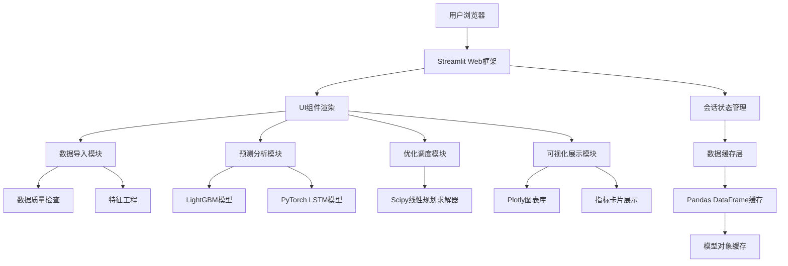
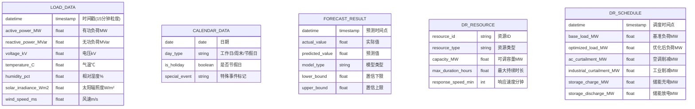

## 1. 架构设计

本系统采用Streamlit作为前端展示框架，Python作为后端计算引擎，整体为单页Web应用架构。数据处理、模型训练、优化求解均在服务端完成，前端负责交互配置和结果可视化展示。



## 2. 技术选型说明

- **前端框架**: Streamlit@1.31.0 - 快速构建数据科学Web应用，原生支持Python生态
- **数据处理**: Pandas@2.1.0, NumPy@1.26.0 - 高性能时间序列数据处理
- **机器学习**: 
  - LightGBM@4.1.0 - 梯度提升树模型，用于短期负荷预测
  - PyTorch@2.1.0 - 深度学习框架，用于LSTM模型构建和训练
- **优化求解**: Scipy@1.11.0 - 线性规划求解器(linprog)，用于需求响应优化
- **可视化**: Plotly@5.18.0 - 交互式图表库，支持时间序列、热力图、散点图等
- **项目结构**: 模块化设计，各功能独立封装，便于维护和扩展

## 3. 模块设计

| 模块名称 | 文件路径 | 核心功能 |
|---------|----------|----------|
| 主应用入口 | app.py | Streamlit页面路由、侧边栏导航、全局状态管理 |
| 数据导入模块 | src/data_loader.py | CSV文件读取、数据格式校验、类型转换 |
| 数据质量检查 | src/data_quality.py | 缺失率统计、异常值检测(IQR方法)、时间连续性检查 |
| 特征工程模块 | src/feature_engineering.py | 历史负荷特征、滑动均值、时间编码、气象特征 |
| 短期预测模块 | src/short_term_forecast.py | LightGBM/LSTM模型训练、预测、评估指标计算 |
| 超短期预测模块 | src/ultra_short_forecast.py | 滑动窗口预测、在线增量学习、预测区间估计 |
| 峰谷分析模块 | src/peak_valley_analysis.py | 峰谷特征提取、月度趋势统计、尖峰时段识别 |
| 需求响应优化 | src/demand_response.py | 线性规划建模、最优调度求解、成本效益分析 |
| 误差分析模块 | src/error_analysis.py | MAPE/RMSE计算、误差分布、相关性分析、归因管理 |
| 可视化模块 | src/visualization.py | 时序图、对比图、热力图、指标仪表盘等 |
| 工具函数 | src/utils.py | 通用辅助函数、配置管理 |
| 示例数据生成 | scripts/generate_sample_data.py | 生成模拟训练数据 |

## 4. 核心数据模型

### 4.1 负荷气象数据表



### 4.2 数据字段规范

| 表名 | 字段名 | 类型 | 说明 | 单位 | 取值范围 |
|------|--------|------|------|------|---------|
| LOAD_DATA | datetime | datetime | 时间戳 | - | 15分钟间隔 |
| LOAD_DATA | active_power_MW | float | 有功负荷 | MW | > 0 |
| LOAD_DATA | reactive_power_MVar | float | 无功负荷 | MVar | > 0 |
| LOAD_DATA | voltage_kV | float | 母线电压 | kV | 10-500 |
| LOAD_DATA | temperature_C | float | 环境温度 | ℃ | -20~45 |
| LOAD_DATA | humidity_pct | float | 相对湿度 | % | 0-100 |
| LOAD_DATA | solar_irradiance_Wm2 | float | 太阳辐照度 | W/m² | 0-1200 |
| LOAD_DATA | wind_speed_ms | float | 风速 | m/s | 0-30 |
| CALENDAR_DATA | date | date | 日期 | - | - |
| CALENDAR_DATA | day_type | string | 日类型 | - | 工作日/周末/节假日 |
| CALENDAR_DATA | is_holiday | bool | 是否节假日 | - | True/False |
| CALENDAR_DATA | special_event | string | 特殊事件 | - | 可选标记 |

## 5. 核心算法设计

### 5.1 特征工程流程

```python
# 时间特征编码
hour_sin = sin(2 * π * hour / 24)
hour_cos = cos(2 * π * hour / 24)
month_sin = sin(2 * π * month / 12)
month_cos = cos(2 * π * month / 12)

# 历史负荷特征
load_lag_1d = load.shift(96)   # 前1天同时刻
load_lag_7d = load.shift(672)  # 前7天同时刻
load_lag_14d = load.shift(1344) # 前14天同时刻

# 滑动均值特征
rolling_4h = load.rolling(16).mean()   # 4小时均值
rolling_12h = load.rolling(48).mean()  # 12小时均值
rolling_24h = load.rolling(96).mean()  # 24小时均值
```

### 5.2 LightGBM模型配置

```python
params = {
    'objective': 'regression',
    'metric': ['mape', 'rmse'],
    'boosting_type': 'gbdt',
    'num_leaves': 63,
    'learning_rate': 0.05,
    'feature_fraction': 0.9,
    'bagging_fraction': 0.8,
    'bagging_freq': 5,
    'num_boost_round': 1000,
    'early_stopping_rounds': 50,
    'verbose': -1
}
```

### 5.3 LSTM网络结构

```
Input Layer (sequence_length=96, features=n_features)
    ↓
LSTM Layer (hidden_size=128, return_sequences=True)
    ↓
Dropout Layer (rate=0.2)
    ↓
LSTM Layer (hidden_size=64, return_sequences=False)
    ↓
Dropout Layer (rate=0.2)
    ↓
Dense Layer (units=32, activation='relu')
    ↓
Dense Layer (units=1, activation='linear')
```

### 5.4 需求响应线性规划模型

**目标函数：最小化峰谷差**
```
min (max(load) - min(load))
```

**约束条件：**
1. 总用电量守恒：Σ(adjusted_load) = Σ(base_load)
2. 各资源出力上下限：0 ≤ resource_i ≤ capacity_i
3. 最大削减持续时长：consecutive_curtailment ≤ max_duration
4. 舒适度约束：Δtemperature ≤ 2℃
5. 储能约束：SOC_min ≤ SOC ≤ SOC_max

**决策变量：**
- x_ac,t: t时刻空调负荷削减量
- x_ind,t: t时刻工业负荷削减量
- x_charge,t: t时刻储能充电功率
- x_discharge,t: t时刻储能放电功率

## 6. 预测区间估计

采用分位数回归方法估计预测区间：
- 训练LightGBM分位数模型(quantile regression)
- alpha=0.2，即80%置信区间
- 分别预测第10分位数和第90分位数作为上下界
- 超短期预测区间上下浮动20%

## 7. 性能优化策略

1. **数据缓存**: 使用@st.cache_data缓存已处理数据，避免重复计算
2. **模型缓存**: 使用@st.cache_resource缓存训练好的模型对象
3. **增量训练**: 超短期预测支持新数据到达后增量更新，无需全量重训
4. **异步计算**: 模型训练在后台线程执行，前端展示进度
5. **采样显示**: 大数据量可视化时采用降采样策略，保持交互流畅
6. **内存管理**: 及时清理不再使用的大对象，优化内存占用

## 8. 项目目录结构

```
grid-forecast/
├── app.py                      # Streamlit主应用入口
├── requirements.txt            # Python依赖清单
├── .gitignore
├── .trae/
│   └── documents/
│       ├── PRD.md              # 产品需求文档
│       └── technical_architecture.md  # 技术架构文档
├── src/                        # 源代码目录
│   ├── __init__.py
│   ├── data_loader.py          # 数据导入模块
│   ├── data_quality.py         # 数据质量检查模块
│   ├── feature_engineering.py  # 特征工程模块
│   ├── short_term_forecast.py  # 短期预测模块
│   ├── ultra_short_forecast.py # 超短期预测模块
│   ├── peak_valley_analysis.py # 峰谷分析模块
│   ├── demand_response.py      # 需求响应模块
│   ├── error_analysis.py       # 误差分析模块
│   ├── visualization.py        # 可视化模块
│   └── utils.py                # 工具函数
├── scripts/                    # 脚本目录
│   └── generate_sample_data.py # 示例数据生成脚本
├── data/                       # 数据目录
│   ├── raw/                    # 原始数据
│   └── processed/              # 处理后数据
└── models/                     # 模型保存目录
    └── trained/                # 训练好的模型
```

## 9. 依赖库版本

| 库名称 | 版本 | 用途 |
|--------|------|------|
| streamlit | 1.31.0 | Web应用框架 |
| pandas | 2.1.4 | 数据处理 |
| numpy | 1.26.3 | 数值计算 |
| lightgbm | 4.1.0 | 梯度提升树模型 |
| torch | 2.1.2 | 深度学习框架 |
| scipy | 1.11.4 | 优化求解 |
| plotly | 5.18.0 | 可视化图表 |
| scikit-learn | 1.3.2 | 机器学习工具 |
| openpyxl | 3.1.2 | Excel文件处理 |
